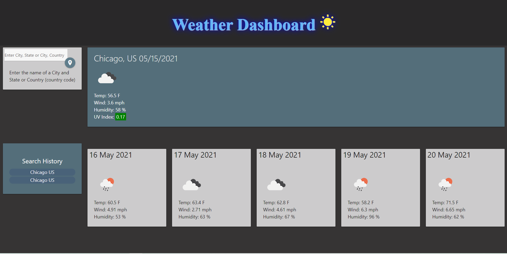

# 06-hw-weather-dashboard
Creating a dashboard that will display weather conditions in the specified city

After typing in a city name and pressing 'Go' data about the city's weather will show
This data includes the 5-day forecast as well as the current weather conditions
Icons showing the weather conditions will appear as well as a color coded UV index element

Site link hosted on GitHub: https://kashelton17.github.io/06-hw-weather-dashboard/

